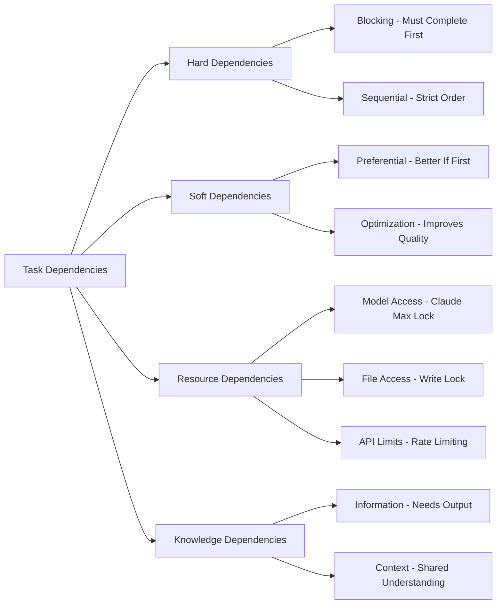

# BUMBA CLI - Advanced Dependency Management Architecture

## Executive Summary

This document outlines the comprehensive dependency management system for BUMBA CLI's multi-agent orchestration, enabling intelligent task interdependency handling, parallel execution optimization, and cross-agent communication.

---

## 1. Conceptual Overview

### 1.1 Dependency Types



### 1.2 Dependency Relationships

**Epic → Sprint → Task → Subtask**

```yaml
Epic: "Build E-commerce Platform"
  Sprint-1: "User Authentication"
    Task-1.1: "Design Auth Schema"         # No dependencies
    Task-1.2: "Implement Backend Auth"     # Depends on 1.1
    Task-1.3: "Create Login UI"            # Soft depends on 1.1
    Task-1.4: "Integration Testing"        # Depends on 1.2, 1.3
    
  Sprint-2: "Product Catalog"  
    Task-2.1: "Design Product Schema"      # No dependencies
    Task-2.2: "Build Product API"          # Depends on 2.1
    Task-2.3: "Create Product UI"          # Depends on 2.1, soft on 2.2
```

---

## 2. Dependency Management Components

### 2.1 Dependency Graph Engine

```javascript
class EnhancedDependencyGraph {
  constructor() {
    this.nodes = new Map();      // taskId -> TaskNode
    this.edges = new Map();      // taskId -> Edge[]
    this.clusters = new Map();   // clusterId -> TaskId[]
    this.criticalPaths = [];     // Longest dependency chains
  }

  // Dependency Types
  addHardDependency(fromTask, toTask, metadata = {}) {
    // Blocking dependency - must complete
  }

  addSoftDependency(fromTask, toTask, weight = 0.5) {
    // Preferential dependency - improves quality
  }

  addResourceDependency(task, resource, exclusive = false) {
    // Resource lock dependency
  }

  addKnowledgeDependency(consumerTask, producerTask, dataType) {
    // Information flow dependency
  }
}
```

### 2.2 Dependency Resolver

```javascript
class DependencyResolver {
  constructor(graph) {
    this.graph = graph;
    this.resolutionStrategies = new Map();
    this.conflictHandlers = new Map();
  }

  // Resolution Strategies
  resolveExecutionOrder(tasks) {
    // 1. Topological sort for hard dependencies
    // 2. Optimization for soft dependencies
    // 3. Resource availability scheduling
    // 4. Critical path prioritization
  }

  detectConflicts(tasks) {
    // - Circular dependencies
    // - Resource contentions
    // - Impossible schedules
    // - Knowledge gaps
  }

  optimizeParallelExecution(tasks) {
    // Identify independent task clusters
    // Maximize parallelization
    // Minimize wait times
  }
}
```

### 2.3 Inter-Agent Communication Protocol

```javascript
class DependencyCommunicationProtocol {
  constructor() {
    this.channels = new Map();  // agentId -> CommunicationChannel
    this.subscriptions = new Map(); // topic -> Set<agentId>
  }

  // Communication Patterns
  publishTaskCompletion(agentId, taskId, outputs) {
    // Notify dependent agents
  }

  subscribeToPrerequisite(agentId, prerequisiteTaskId, callback) {
    // Wait for dependency completion
  }

  negotiateDependency(requestor, provider, dependency) {
    // Dynamic dependency negotiation
  }

  broadcastBlockage(agentId, blockingDependency) {
    // Alert managers of blockages
  }
}
```

---

## 3. Implementation Strategy

### 3.1 Manager-Level Dependency Analysis

```javascript
class ManagerDependencyAnalyzer {
  constructor(manager) {
    this.manager = manager;
    this.domainKnowledge = new DomainKnowledgeBase();
  }

  analyzePrompt(userPrompt) {
    // 1. Decompose into tasks
    const tasks = this.decomposeIntoTasks(userPrompt);
    
    // 2. Identify dependencies
    const dependencies = this.identifyDependencies(tasks);
    
    // 3. Create execution plan
    const plan = this.createExecutionPlan(tasks, dependencies);
    
    // 4. Allocate to specialists
    const allocation = this.allocateToSpecialists(plan);
    
    return {
      tasks,
      dependencies,
      plan,
      allocation,
      criticalPath: this.calculateCriticalPath(plan)
    };
  }

  identifyDependencies(tasks) {
    const dependencies = [];
    
    for (const task of tasks) {
      // Technical dependencies
      if (task.type === 'implementation' && 
          tasks.some(t => t.type === 'design' && t.component === task.component)) {
        dependencies.push({
          type: 'hard',
          from: task.id,
          to: designTask.id,
          reason: 'Implementation requires design'
        });
      }
      
      // Data dependencies
      if (task.requiresData) {
        const dataProvider = tasks.find(t => t.produces === task.requiresData);
        if (dataProvider) {
          dependencies.push({
            type: 'knowledge',
            from: task.id,
            to: dataProvider.id,
            dataType: task.requiresData
          });
        }
      }
      
      // Resource dependencies
      if (task.requiresExclusiveResource) {
        dependencies.push({
          type: 'resource',
          task: task.id,
          resource: task.requiresExclusiveResource,
          exclusive: true
        });
      }
    }
    
    return dependencies;
  }
}
```

### 3.2 Specialist-Level Dependency Handling

```javascript
class SpecialistDependencyHandler {
  constructor(specialist) {
    this.specialist = specialist;
    this.dependencies = new Map();
    this.blockedOn = new Set();
    this.outputs = new Map();
  }

  async executeWithDependencies(task, dependencies) {
    // Wait for dependencies
    await this.waitForDependencies(dependencies);
    
    // Gather dependency outputs
    const inputs = await this.gatherDependencyOutputs(dependencies);
    
    // Execute task
    const result = await this.specialist.execute(task, inputs);
    
    // Publish outputs for dependent tasks
    await this.publishOutputs(task.id, result);
    
    return result;
  }

  async waitForDependencies(dependencies) {
    const promises = dependencies.map(dep => 
      this.subscribeToDependency(dep)
    );
    
    return Promise.all(promises);
  }

  subscribeToDependency(dependency) {
    return new Promise((resolve) => {
      const channel = this.getCommunicationChannel();
      channel.subscribe(`task:${dependency.taskId}:complete`, (data) => {
        this.outputs.set(dependency.taskId, data.outputs);
        resolve(data);
      });
    });
  }
}
```

---

## 4. Dependency Patterns

### 4.1 Common Patterns

#### Sequential Pipeline
```
Design → Implementation → Testing → Deployment
```

#### Parallel with Join
```
Frontend ─┐
          ├→ Integration → Testing
Backend  ─┘
```

#### Fan-out Fan-in
```
Analysis → Component-A → Integration
        └→ Component-B ─┘
        └→ Component-C ─┘
```

### 4.2 Anti-Patterns to Avoid

- **Circular Dependencies**: A → B → C → A
- **Over-Serialization**: Making everything sequential
- **Hidden Dependencies**: Not declaring known dependencies
- **Resource Starvation**: Too many tasks competing for same resource

---

## 5. Dependency Visualization

### 5.1 Real-time Dependency Dashboard

```javascript
class DependencyVisualizer {
  constructor(dependencyManager) {
    this.dm = dependencyManager;
  }

  generateVisualization() {
    return {
      graph: this.generateGraphML(),
      ganttChart: this.generateGanttData(),
      criticalPath: this.highlightCriticalPath(),
      blockages: this.identifyBlockages(),
      parallelizationOpportunities: this.findParallelizable()
    };
  }

  generateStatusReport() {
    return {
      totalTasks: this.dm.getAllTasks().length,
      readyTasks: this.dm.getReadyTasks().length,
      blockedTasks: this.dm.getBlockedTasks().length,
      completedTasks: this.dm.getCompletedTasks().length,
      criticalPathLength: this.dm.getCriticalPath().length,
      estimatedCompletion: this.estimateCompletionTime()
    };
  }
}
```

---

## 6. Integration Points

### 6.1 Framework Integration

```javascript
// In bumba-framework-2.js
class BumbaFramework2 {
  async processCommandWithDependencies(command, args, context) {
    // 1. Analyze dependencies
    const analysis = this.dependencyAnalyzer.analyzePrompt(command, args);
    
    // 2. Create execution plan
    const plan = this.dependencyResolver.createExecutionPlan(analysis);
    
    // 3. Setup communication channels
    const channels = this.setupInterAgentCommunication(plan);
    
    // 4. Execute with dependency management
    return this.executeWithDependencies(plan, channels);
  }
}
```

### 6.2 Hook System Integration

```javascript
// Dependency-aware hooks
hooks.register('task:starting', async (task) => {
  const deps = await dependencyManager.checkDependencies(task.id);
  if (deps.blocked) {
    throw new Error(`Task blocked on: ${deps.blockingTasks.join(', ')}`);
  }
});

hooks.register('task:completed', async (task) => {
  await dependencyManager.markComplete(task.id);
  const unblocked = await dependencyManager.getUnblockedTasks();
  
  // Trigger newly unblocked tasks
  for (const taskId of unblocked) {
    await taskQueue.enqueue(taskId);
  }
});
```

---

## 7. Example Usage

### 7.1 Complex Project with Dependencies

```javascript
// User prompt: "Build a real-time chat application"

const project = {
  epic: "Real-time Chat Application",
  sprints: [
    {
      id: "sprint-1",
      name: "Backend Infrastructure",
      tasks: [
        { id: "t1", name: "Setup WebSocket server", specialist: "backend" },
        { id: "t2", name: "Design message schema", specialist: "architect" },
        { id: "t3", name: "Implement auth", specialist: "security", depends: ["t2"] },
        { id: "t4", name: "Create message API", specialist: "backend", depends: ["t2", "t3"] }
      ]
    },
    {
      id: "sprint-2", 
      name: "Frontend",
      tasks: [
        { id: "t5", name: "Design UI mockup", specialist: "designer" },
        { id: "t6", name: "Implement chat UI", specialist: "frontend", depends: ["t5"] },
        { id: "t7", name: "WebSocket client", specialist: "frontend", depends: ["t1", "t6"] },
        { id: "t8", name: "Integration", specialist: "fullstack", depends: ["t4", "t7"] }
      ]
    }
  ]
};

// Dependency resolution
const executionPlan = dependencyManager.resolveProject(project);

// Parallel execution groups
// Group 1: [t1, t2, t5] - No dependencies
// Group 2: [t3, t6] - After Group 1
// Group 3: [t4, t7] - After Group 2
// Group 4: [t8] - After Group 3
```

### 7.2 Dynamic Dependency Discovery

```javascript
class DynamicDependencyDiscovery {
  async discoverDependencies(task, codebase) {
    const dependencies = [];
    
    // Analyze imports/requires
    if (task.type === 'implementation') {
      const requiredModules = await this.analyzeImports(task.file);
      for (const module of requiredModules) {
        if (!codebase.hasModule(module)) {
          dependencies.push({
            type: 'implementation',
            module: module,
            task: `implement-${module}`
          });
        }
      }
    }
    
    // Analyze test requirements
    if (task.type === 'testing') {
      const componentToTest = task.component;
      if (!codebase.hasComponent(componentToTest)) {
        dependencies.push({
          type: 'implementation',
          component: componentToTest,
          task: `implement-${componentToTest}`
        });
      }
    }
    
    return dependencies;
  }
}
```

---

## 8. Benefits of This System

### 8.1 For Managers
- **Intelligent Planning**: Automatic dependency detection and planning
- **Optimal Allocation**: Assign tasks based on dependency readiness
- **Conflict Prevention**: Detect impossible schedules early
- **Progress Tracking**: Real-time visibility into blockages

### 8.2 For Specialists
- **Clear Prerequisites**: Know exactly what they're waiting for
- **Automatic Triggering**: Start immediately when dependencies are met
- **Output Sharing**: Seamless handoff of results to dependent tasks
- **Reduced Idle Time**: Work on independent tasks while blocked

### 8.3 For the System
- **Maximized Parallelism**: Run all possible tasks simultaneously
- **Minimized Completion Time**: Critical path optimization
- **Resource Efficiency**: Prevent resource conflicts
- **Quality Improvement**: Ensure proper sequencing

---

## 9. Implementation Roadmap

### Phase 1: Core Dependency Engine (Week 1)
- Enhance existing DependencyManager
- Implement dependency types (hard, soft, resource, knowledge)
- Add circular dependency detection
- Create dependency resolver

### Phase 2: Inter-Agent Communication (Week 2)
- Build communication protocol
- Implement publish/subscribe for dependencies
- Add dependency negotiation
- Create blockage notifications

### Phase 3: Manager Integration (Week 3)
- Add dependency analysis to managers
- Implement automatic dependency detection
- Create execution planning with dependencies
- Add specialist allocation based on dependencies

### Phase 4: Visualization & Monitoring (Week 4)
- Build dependency dashboard
- Create Gantt chart generator
- Add critical path highlighting
- Implement real-time status updates

---

## 10. Conclusion

This comprehensive dependency management system will transform BUMBA CLI from parallel execution to **intelligent orchestration**. By understanding and managing task interdependencies, the framework can:

1. **Optimize execution order** for fastest completion
2. **Prevent conflicts** and impossible states
3. **Maximize parallelization** where possible
4. **Ensure quality** through proper sequencing
5. **Provide visibility** into project progress and blockages

The system respects the hierarchical nature of the framework while enabling sophisticated cross-agent communication and coordination, making BUMBA truly production-ready for complex, interdependent projects.

---

*"Dependencies are not constraints; they are the intelligence that transforms chaos into orchestration."* - BUMBA Architecture Principle