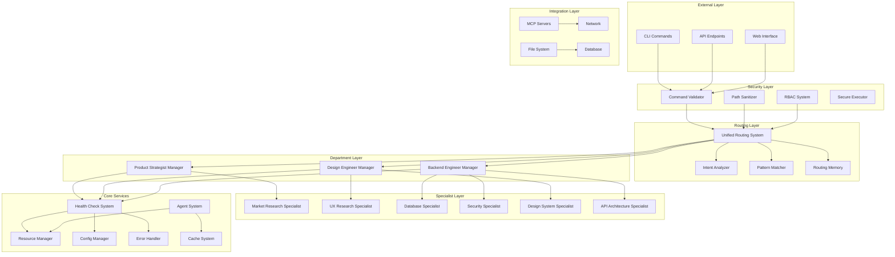
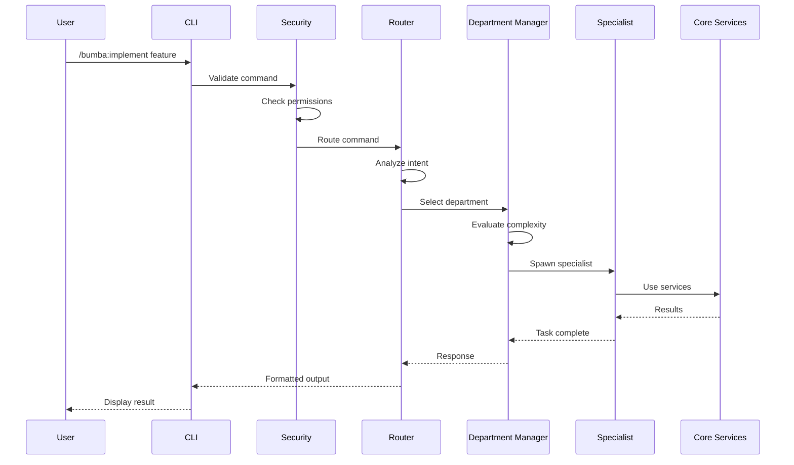
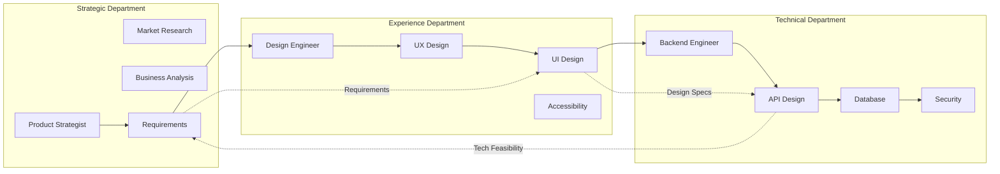
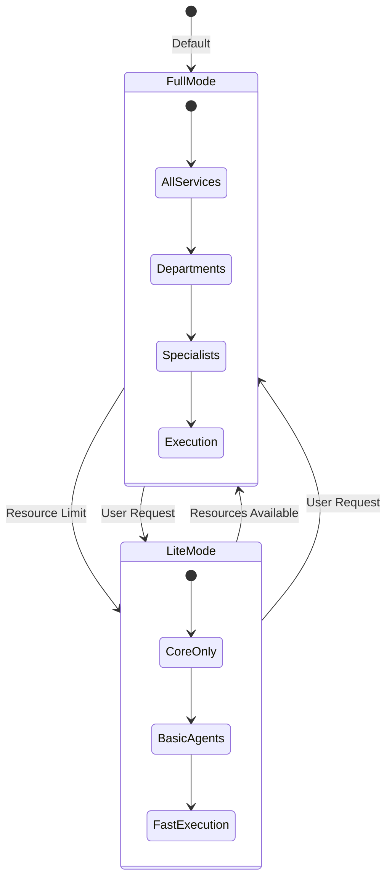
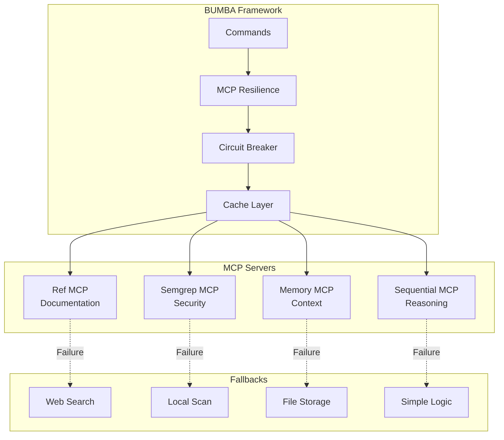
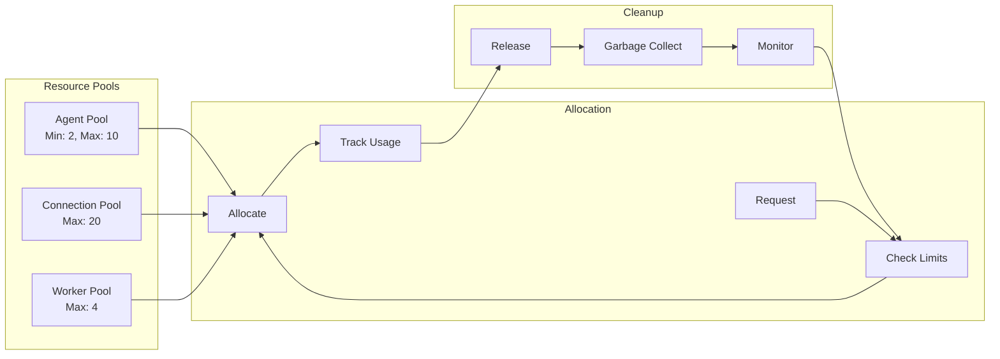
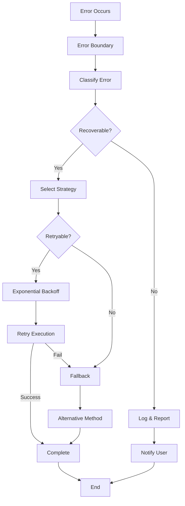
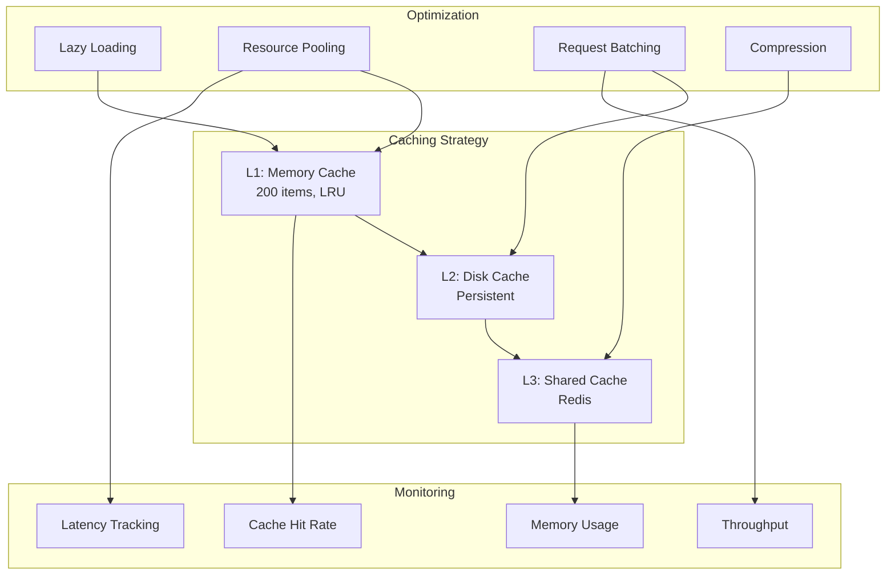
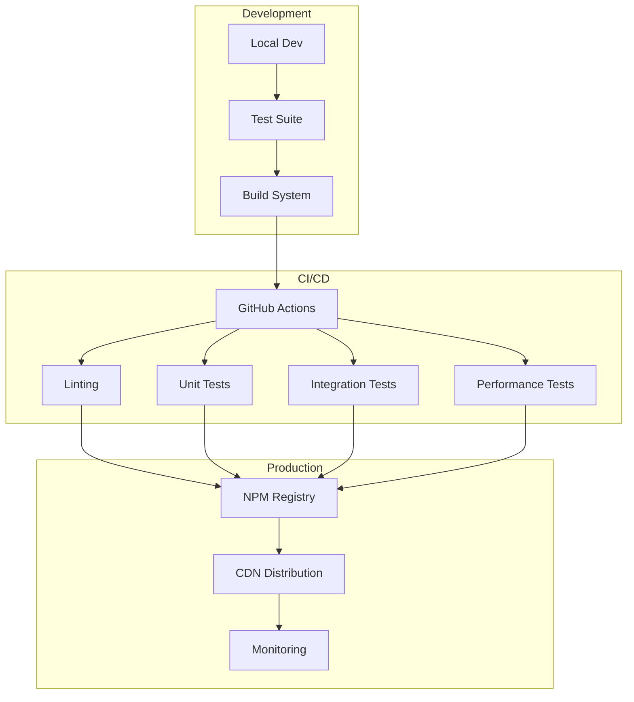

# BUMBA Framework Visual Architecture

## System Overview



## Command Flow Sequence



## Department Coordination



## Health Monitoring System

```mermaid
graph TD
    subgraph "Health Checks"
        SYS[System Health]
        FS2[File System]
        DEP[Dependencies]
        COMP[Components]
    end
    
    subgraph "Monitoring"
        CPU[CPU Usage]
        MEM[Memory]
        DISK[Disk Space]
        NET2[Network]
    end
    
    subgraph "Endpoints"
        HE[/health]
        LE[/liveness]
        RE[/readiness]
    end
    
    subgraph "Actions"
        AR[Auto Repair]
        AL[Alerts]
        LOG[Logging]
    end
    
    SYS --> CPU
    SYS --> MEM
    FS2 --> DISK
    DEP --> NET2
    
    CPU --> HE
    MEM --> HE
    DISK --> LE
    NET2 --> RE
    
    HE --> AR
    LE --> AL
    RE --> LOG
```

## Mode Switching Architecture



## MCP Server Integration



## Resource Management



## Error Handling Flow



## Performance Optimization



## Deployment Architecture



---

These diagrams provide a visual understanding of:
- System architecture and component relationships
- Command flow and processing sequence
- Department coordination and handoffs
- Health monitoring and auto-repair
- Mode switching between Full and Lite
- MCP server integration with fallbacks
- Resource management and pooling
- Error handling strategies
- Performance optimization layers
- Deployment and CI/CD pipeline

The diagrams use Mermaid syntax and can be rendered in any Markdown viewer that supports Mermaid (GitHub, GitLab, VS Code with extensions, etc.).