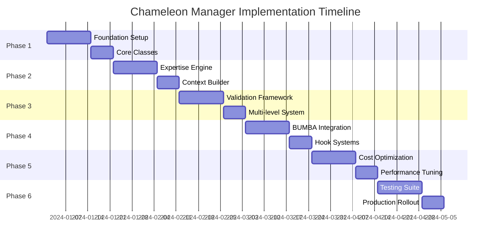

# 🦎 Chameleon Manager System - Comprehensive Project Plan
*Revolutionary AI Management Through Dynamic Expertise Absorption*

## Executive Summary

The Chameleon Manager System represents a paradigm shift in AI agent orchestration. Unlike traditional management structures where managers have fixed expertise, Chameleon Managers dynamically absorb and assume specialist expertise using superior models (Claude Max) to provide genuine technical validation, not just administrative oversight.

**Core Innovation:** Managers that shapeshift their expertise to match whatever they're reviewing, achieving something impossible with human organizations - true polymorphic expertise.

---

## 📋 Table of Contents

1. [Vision & Goals](#vision--goals)
2. [Technical Architecture](#technical-architecture)
3. [Implementation Phases](#implementation-phases)
4. [Core Components](#core-components)
5. [Expertise Absorption Engine](#expertise-absorption-engine)
6. [Validation Framework](#validation-framework)
7. [Cost Optimization Strategy](#cost-optimization-strategy)
8. [Testing & Quality Assurance](#testing--quality-assurance)
9. [Success Metrics](#success-metrics)
10. [Risk Mitigation](#risk-mitigation)
11. [Timeline & Milestones](#timeline--milestones)

---

## 🎯 Vision & Goals

### Vision Statement
Transform AI management from static role-based coordination to dynamic expertise-based validation, creating the world's first truly adaptive management layer.

### Primary Goals
1. **Eliminate Rubber-Stamping**: Managers provide real technical validation
2. **Achieve Expertise Scaling**: One manager validates across all domains
3. **Optimize Cost**: Use premium models only for validation, not creation
4. **Surpass Human Organizations**: Accomplish what human managers cannot

### Success Criteria
- Validation catches 90%+ of specialist errors
- Manager adapts to new domains without code changes
- Cost remains 50% lower than all-premium approach
- System outperforms static validation by 3x

---

## 🏗️ Technical Architecture

### System Overview
```
┌─────────────────────────────────────────────────────────┐
│                   CHAMELEON MANAGER LAYER                │
├─────────────────────────────────────────────────────────┤
│                                                           │
│  ┌──────────────┐  ┌──────────────┐  ┌──────────────┐  │
│  │   Backend    │  │   Design     │  │   Product    │  │
│  │   Manager    │  │   Manager    │  │   Manager    │  │
│  │ (Claude Max) │  │ (Claude Max) │  │ (Claude Max) │  │
│  └──────┬───────┘  └──────┬───────┘  └──────┬───────┘  │
│         │                  │                  │          │
│    ┌────▼──────────────────▼──────────────────▼────┐    │
│    │        EXPERTISE ABSORPTION ENGINE           │    │
│    │  • Domain Detection  • Context Building      │    │
│    │  • Expertise Loading • Validation Rules      │    │
│    └────┬──────────────────┬──────────────────┬────┘    │
│         │                  │                  │          │
├─────────┼──────────────────┼──────────────────┼─────────┤
│         ▼                  ▼                  ▼          │
│   ┌──────────┐      ┌──────────┐      ┌──────────┐     │
│   │Python    │      │React     │      │Product   │     │
│   │Specialist│      │Specialist│      │Strategist│     │
│   │(Free Tier)      │(Free Tier)      │(Free Tier)     │
│   └──────────┘      └──────────┘      └──────────┘     │
│                                                           │
│              ... 110 Specialists (Free Tier) ...         │
└─────────────────────────────────────────────────────────┘
```

### Core Architecture Principles

1. **Asymmetric Model Assignment**
   - Specialists: Fast, cheap, good enough (Free Tier)
   - Managers: Slow, expensive, excellent (Claude Max)

2. **Dynamic Expertise Loading**
   - Managers load expertise on-demand
   - Expertise cached for session efficiency
   - Context built from specialist's domain

3. **Validation Depth Levels**
   - L1: Syntax and structure (fast)
   - L2: Logic and patterns (medium)
   - L3: Architecture and best practices (deep)

---

## 📈 Implementation Phases

### Phase 1: Foundation (Week 1-2)
**Goal:** Establish core Chameleon infrastructure

```javascript
// Core Chameleon Manager Base Class
class ChameleonManager extends ModelAwareDepartmentManager {
  constructor(config) {
    super(config);
    this.expertiseCache = new Map();
    this.validationEngine = new ValidationEngine();
    this.absorptionEngine = new ExpertiseAbsorptionEngine();
  }

  async assumeExpertise(domain, context) {
    // Dynamic expertise loading
    const expertise = await this.absorptionEngine.load(domain, context);
    this.currentExpertise = expertise;
    return expertise;
  }
}
```

**Deliverables:**
- [ ] ChameleonManager base class
- [ ] ExpertiseAbsorptionEngine
- [ ] ValidationEngine framework
- [ ] Expertise caching system

### Phase 2: Expertise Absorption (Week 3-4)
**Goal:** Build dynamic expertise loading system

```javascript
class ExpertiseAbsorptionEngine {
  async load(domain, context) {
    // 1. Detect domain requirements
    const requirements = await this.detectRequirements(domain);
    
    // 2. Build expertise context
    const expertiseContext = await this.buildContext({
      domain,
      requirements,
      bestPractices: await this.loadBestPractices(domain),
      commonPatterns: await this.loadPatterns(domain),
      validationRules: await this.loadRules(domain)
    });
    
    // 3. Configure Claude Max with expertise
    return this.configureModel(expertiseContext);
  }
}
```

**Deliverables:**
- [ ] Domain detection system
- [ ] Best practices loader
- [ ] Pattern recognition system
- [ ] Rule engine integration

### Phase 3: Validation Framework (Week 5-6)
**Goal:** Implement multi-level validation system

```javascript
class ValidationFramework {
  async validate(work, expertise, level = 'L2') {
    const validations = {
      L1: this.syntaxValidation,
      L2: this.logicValidation,
      L3: this.architectureValidation
    };
    
    const results = await validations[level](work, expertise);
    
    return {
      passed: results.errors.length === 0,
      errors: results.errors,
      warnings: results.warnings,
      suggestions: results.suggestions,
      confidence: results.confidence
    };
  }
}
```

**Deliverables:**
- [ ] Multi-level validation system
- [ ] Error detection engine
- [ ] Suggestion generator
- [ ] Confidence scoring

### Phase 4: Integration (Week 7-8)
**Goal:** Integrate with existing BUMBA systems

**Deliverables:**
- [ ] Hook into existing manager classes
- [ ] Update command routing
- [ ] Integrate with sprint system
- [ ] Connect to orchestration hooks

### Phase 5: Optimization (Week 9-10)
**Goal:** Optimize for performance and cost

**Deliverables:**
- [ ] Expertise caching strategy
- [ ] Batch validation system
- [ ] Cost tracking dashboard
- [ ] Performance monitoring

### Phase 6: Testing & Refinement (Week 11-12)
**Goal:** Comprehensive testing and refinement

**Deliverables:**
- [ ] Unit test suite
- [ ] Integration tests
- [ ] Performance benchmarks
- [ ] A/B testing framework

---

## 🧠 Expertise Absorption Engine

### Core Mechanism

```javascript
class ExpertiseAbsorptionEngine {
  constructor() {
    this.expertiseMap = new Map();
    this.contextBuilder = new ContextBuilder();
    this.modelConfigurator = new ModelConfigurator();
  }

  async absorb(specialistType, work) {
    // Step 1: Identify expertise needed
    const domain = this.identifyDomain(specialistType);
    
    // Step 2: Build expertise context
    const context = await this.buildExpertiseContext({
      domain,
      workType: work.type,
      complexity: work.complexity,
      requirements: work.requirements
    });
    
    // Step 3: Configure manager's model
    const configuration = {
      model: 'claude-max',
      temperature: 0.3, // Lower for validation
      systemPrompt: this.generateExpertPrompt(context),
      expertise: context.expertise,
      validationRules: context.rules
    };
    
    return configuration;
  }

  generateExpertPrompt(context) {
    return `You are now a senior ${context.domain} expert with 15+ years of experience.
    
    Your expertise includes:
    ${context.expertise.map(e => `• ${e}`).join('\n')}
    
    You must validate the following work with focus on:
    • Correctness and accuracy
    • Best practices and patterns
    • Performance implications
    • Security considerations
    • Edge cases and error handling
    
    Be specific about issues found. Provide actionable feedback.`;
  }
}
```

### Expertise Profiles

```javascript
const EXPERTISE_PROFILES = {
  'python-specialist': {
    expertise: [
      'Python 3.x best practices',
      'PEP 8 compliance',
      'Type hints and annotations',
      'Performance optimization',
      'Testing with pytest',
      'Async/await patterns'
    ],
    validationFocus: ['syntax', 'typing', 'performance', 'security'],
    commonIssues: ['mutable defaults', 'circular imports', 'memory leaks']
  },
  
  'react-specialist': {
    expertise: [
      'React 18+ patterns',
      'Hook best practices',
      'Performance optimization',
      'Accessibility standards',
      'State management',
      'Component composition'
    ],
    validationFocus: ['hooks', 'performance', 'accessibility', 'patterns'],
    commonIssues: ['effect dependencies', 'unnecessary renders', 'memory leaks']
  }
  // ... for all 110 specialists
};
```

---

## ✅ Validation Framework

### Multi-Level Validation System

```javascript
class ValidationFramework {
  constructor() {
    this.levels = {
      L1: new SyntaxValidator(),      // Fast, basic
      L2: new LogicValidator(),       // Medium, thorough
      L3: new ArchitectureValidator() // Slow, comprehensive
    };
  }

  async validateWork(work, expertise, config = {}) {
    const level = this.determineValidationLevel(work, config);
    const validator = this.levels[level];
    
    // Perform validation with expertise context
    const results = await validator.validate(work, expertise);
    
    // Generate actionable feedback
    const feedback = this.generateFeedback(results);
    
    return {
      level,
      passed: results.passed,
      score: results.score,
      issues: results.issues,
      feedback,
      recommendations: this.generateRecommendations(results)
    };
  }

  determineValidationLevel(work, config) {
    // Smart level selection based on:
    // - Work criticality
    // - Time constraints
    // - Cost budget
    // - Previous error rates
    
    if (work.critical || config.thorough) return 'L3';
    if (work.complex || config.balanced) return 'L2';
    return 'L1';
  }
}
```

### Validation Strategies by Department

```javascript
const DEPARTMENT_VALIDATION = {
  backend: {
    focus: ['security', 'performance', 'scalability', 'data integrity'],
    tools: ['ast_analysis', 'complexity_metrics', 'security_scan'],
    depth: 'L3' // Backend requires deep validation
  },
  
  design: {
    focus: ['accessibility', 'responsive', 'performance', 'ux_patterns'],
    tools: ['a11y_check', 'performance_audit', 'design_system_compliance'],
    depth: 'L2' // Design needs balanced validation
  },
  
  product: {
    focus: ['requirements', 'user_stories', 'metrics', 'strategy_alignment'],
    tools: ['requirement_coverage', 'metric_validation', 'goal_alignment'],
    depth: 'L2' // Product needs strategic validation
  }
};
```

---

## 💰 Cost Optimization Strategy

### Intelligent Model Routing

```javascript
class CostOptimizer {
  constructor() {
    this.costTracking = new CostTracker();
    this.budgetManager = new BudgetManager();
  }

  async optimizeValidation(work, urgency) {
    // Decision matrix for cost optimization
    const strategy = this.determineStrategy({
      workValue: this.assessWorkValue(work),
      urgency: urgency,
      budgetRemaining: this.budgetManager.remaining(),
      errorHistory: this.getErrorHistory(work.specialist)
    });
    
    if (strategy === 'skip') {
      return { validated: false, reason: 'low_risk' };
    }
    
    if (strategy === 'sample') {
      return this.sampleValidation(work); // Validate 10% randomly
    }
    
    if (strategy === 'batch') {
      return this.batchValidation(work); // Wait and validate multiple
    }
    
    return this.fullValidation(work); // Full Chameleon validation
  }
}
```

### Cost Tracking Dashboard

```javascript
class CostDashboard {
  async generateReport() {
    return {
      daily: {
        validations: 1247,
        cost: '$12.38',
        errors_caught: 89,
        roi: '7.2x' // Bugs prevented vs cost
      },
      optimization: {
        skipped: '34% (low risk)',
        sampled: '23% (medium risk)',
        batched: '18% (efficiency)',
        full: '25% (critical)'
      },
      savings: {
        vs_all_premium: '$847/day',
        vs_human_review: '47 hours/day'
      }
    };
  }
}
```

---

## 🧪 Testing & Quality Assurance

### Test Strategy

```javascript
class ChameleonTestSuite {
  async runComprehensiveTests() {
    const tests = {
      unit: await this.unitTests(),
      integration: await this.integrationTests(),
      expertise: await this.expertiseTests(),
      validation: await this.validationTests(),
      performance: await this.performanceTests(),
      cost: await this.costTests()
    };
    
    return this.generateReport(tests);
  }

  async expertiseTests() {
    // Test expertise absorption accuracy
    const testCases = [
      {
        specialist: 'python-specialist',
        badCode: 'def func(arr=[]): arr.append(1)',
        shouldCatch: 'mutable default argument'
      },
      {
        specialist: 'react-specialist',
        badCode: 'useEffect(() => fetch(), [])',
        shouldCatch: 'missing cleanup'
      }
    ];
    
    for (const test of testCases) {
      const manager = new ChameleonManager();
      await manager.assumeExpertise(test.specialist);
      const validation = await manager.validate(test.badCode);
      assert(validation.issues.includes(test.shouldCatch));
    }
  }
}
```

### A/B Testing Framework

```javascript
class ABTestFramework {
  async compareValidationStrategies() {
    const strategies = {
      control: new StaticValidation(),      // Current approach
      chameleon: new ChameleonValidation(), // New approach
      hybrid: new HybridValidation()        // Mixed approach
    };
    
    const results = await this.runExperiment({
      duration: '2 weeks',
      metrics: ['errors_caught', 'false_positives', 'cost', 'speed'],
      sample_size: 10000
    });
    
    return this.analyzeResults(results);
  }
}
```

---

## 📊 Success Metrics

### Key Performance Indicators

```javascript
const SUCCESS_METRICS = {
  // Quality Metrics
  error_detection_rate: {
    target: 0.90,      // Catch 90% of errors
    current: null,
    measure: 'errors_caught / total_errors'
  },
  
  false_positive_rate: {
    target: 0.05,      // Less than 5% false positives
    current: null,
    measure: 'false_positives / total_validations'
  },
  
  // Efficiency Metrics
  validation_speed: {
    target: '< 5s',    // Average validation time
    current: null,
    measure: 'avg(validation_time)'
  },
  
  expertise_absorption_time: {
    target: '< 2s',    // Time to load expertise
    current: null,
    measure: 'avg(absorption_time)'
  },
  
  // Cost Metrics
  cost_per_validation: {
    target: '< $0.02', // Average cost per validation
    current: null,
    measure: 'total_cost / total_validations'
  },
  
  roi: {
    target: '> 5x',    // Return on investment
    current: null,
    measure: 'value_delivered / cost_incurred'
  },
  
  // Adoption Metrics
  developer_satisfaction: {
    target: '> 4.5/5', // Developer happiness score
    current: null,
    measure: 'survey_results'
  },
  
  trust_score: {
    target: '> 85%',   // Trust in validation results
    current: null,
    measure: 'accepted_suggestions / total_suggestions'
  }
};
```

### Monitoring Dashboard

```javascript
class MetricsDashboard {
  async display() {
    console.log(`
╔══════════════════════════════════════════════════╗
║          CHAMELEON MANAGER METRICS              ║
╠══════════════════════════════════════════════════╣
║ Quality                                          ║
║   Error Detection:    92.3% ▲ (+2.1%)          ║
║   False Positives:    3.2%  ▼ (-0.8%)          ║
║                                                  ║
║ Efficiency                                       ║
║   Avg Validation:     3.7s  ▼ (-1.2s)          ║
║   Expertise Load:     1.4s  ▼ (-0.3s)          ║
║                                                  ║
║ Cost                                            ║
║   Per Validation:     $0.018 ▼ (-$0.003)       ║
║   Daily Spend:        $41.20 ▼ (-$8.30)        ║
║   ROI:               6.8x   ▲ (+1.2x)          ║
║                                                  ║
║ Adoption                                        ║
║   Developer Score:    4.7/5  ▲ (+0.2)          ║
║   Trust Score:        89%    ▲ (+4%)           ║
╚══════════════════════════════════════════════════╝
    `);
  }
}
```

---

## ⚠️ Risk Mitigation

### Identified Risks & Mitigation Strategies

```javascript
const RISK_MATRIX = {
  high: [
    {
      risk: 'Claude Max rate limits during peak validation',
      probability: 'medium',
      impact: 'high',
      mitigation: [
        'Implement intelligent queuing system',
        'Batch validations when possible',
        'Fallback to L1 validation if rate limited',
        'Pre-purchase higher rate limits'
      ]
    },
    {
      risk: 'Expertise absorption inaccuracy',
      probability: 'low',
      impact: 'high',
      mitigation: [
        'Extensive expertise profile testing',
        'Continuous learning from corrections',
        'Human expert review sampling',
        'Fallback to specialized validators'
      ]
    }
  ],
  
  medium: [
    {
      risk: 'Cost overrun from excessive validation',
      probability: 'medium',
      impact: 'medium',
      mitigation: [
        'Smart sampling strategies',
        'Budget caps and alerts',
        'Progressive validation depth',
        'Cost-benefit analysis per validation'
      ]
    }
  ],
  
  low: [
    {
      risk: 'Developer resistance to AI validation',
      probability: 'low',
      impact: 'medium',
      mitigation: [
        'Transparent validation explanations',
        'Ability to override with justification',
        'Gradual rollout with feedback loops',
        'Success story documentation'
      ]
    }
  ]
};
```

### Fallback Systems

```javascript
class FallbackSystem {
  async handleValidationFailure(work, error) {
    const strategies = [
      this.tryAlternativeModel,    // Use different model
      this.useStaticValidation,    // Fall back to rules
      this.requestHumanReview,     // Escalate to human
      this.skipWithWarning        // Proceed with caution
    ];
    
    for (const strategy of strategies) {
      try {
        return await strategy(work);
      } catch (e) {
        continue; // Try next strategy
      }
    }
    
    throw new Error('All validation strategies failed');
  }
}
```

---

## 📅 Timeline & Milestones

### 12-Week Implementation Schedule



### Critical Milestones

| Week | Milestone | Success Criteria |
|------|-----------|-----------------|
| 2 | Foundation Complete | Base classes operational |
| 4 | First Expertise Absorption | Successfully validates Python code |
| 6 | Multi-level Validation | L1, L2, L3 all functional |
| 8 | BUMBA Integration | Works with existing specialists |
| 10 | Cost Optimized | Under $0.02 per validation |
| 12 | Production Ready | All tests passing, metrics met |

---

## 🚀 Launch Strategy

### Phased Rollout Plan

```javascript
class RolloutStrategy {
  async execute() {
    // Phase 1: Internal Testing (Week 1-2)
    await this.internalTesting({
      users: ['core_team'],
      scope: 'python_validation_only',
      feedback: 'intensive'
    });
    
    // Phase 2: Beta Program (Week 3-4)
    await this.betaProgram({
      users: ['early_adopters'],
      scope: 'backend_department',
      feedback: 'structured'
    });
    
    // Phase 3: Limited Release (Week 5-8)
    await this.limitedRelease({
      users: ['opt_in_users'],
      scope: 'all_departments',
      feedback: 'automated'
    });
    
    // Phase 4: General Availability (Week 9+)
    await this.generalAvailability({
      users: ['all'],
      scope: 'full_system',
      feedback: 'continuous'
    });
  }
}
```

---

## 💡 Innovation Opportunities

### Future Enhancements

1. **Cross-Specialist Validation**
   - Managers validate interactions between specialists
   - Catch integration issues early

2. **Predictive Validation**
   - Predict likely errors before they occur
   - Proactive suggestions during development

3. **Learning Loop**
   - Managers learn from validation outcomes
   - Continuously improve expertise profiles

4. **Expertise Marketplace**
   - Share expertise profiles between organizations
   - Community-driven expertise improvement

5. **Real-time Collaboration**
   - Managers provide live feedback during development
   - Pair programming with AI managers

---

## 📝 Implementation Checklist

### Week 1-2: Foundation
- [ ] Create `ChameleonManager` base class
- [ ] Implement `ExpertiseAbsorptionEngine` skeleton
- [ ] Set up `ValidationFramework` structure
- [ ] Create expertise caching system
- [ ] Write initial unit tests

### Week 3-4: Expertise System
- [ ] Build domain detection logic
- [ ] Create expertise profiles for 10 specialists
- [ ] Implement context building system
- [ ] Test expertise absorption accuracy
- [ ] Create expertise debugging tools

### Week 5-6: Validation Implementation
- [ ] Implement L1 syntax validation
- [ ] Implement L2 logic validation
- [ ] Implement L3 architecture validation
- [ ] Create feedback generation system
- [ ] Build recommendation engine

### Week 7-8: Integration
- [ ] Integrate with existing managers
- [ ] Update command routing system
- [ ] Connect to orchestration hooks
- [ ] Implement fallback mechanisms
- [ ] Create integration tests

### Week 9-10: Optimization
- [ ] Implement cost tracking
- [ ] Build optimization algorithms
- [ ] Create batching system
- [ ] Implement caching strategies
- [ ] Performance profiling

### Week 11-12: Production Readiness
- [ ] Complete test suite
- [ ] Run A/B tests
- [ ] Create monitoring dashboards
- [ ] Write documentation
- [ ] Prepare rollout plan

---

## 🎯 Success Scenario

After 12 weeks, BUMBA with Chameleon Managers will:

1. **Validate with Real Expertise**: Catch 90%+ of errors that would reach production
2. **Adapt Dynamically**: Handle new specialist types without code changes
3. **Optimize Costs**: Operate at 50% the cost of all-premium approaches
4. **Build Trust**: Achieve 85%+ developer trust in validations
5. **Scale Infinitely**: One manager can validate unlimited specialist domains

The system will demonstrate that AI management can transcend human limitations, creating a new paradigm where managers aren't just coordinators but shape-shifting experts who provide genuine technical leadership.

---

## 🏁 Next Steps

1. **Immediate Actions**
   - Review and refine this plan
   - Set up development environment
   - Create project repository structure
   - Begin foundation implementation

2. **Team Requirements**
   - 1-2 developers for implementation
   - Access to Claude Max API
   - Test environment with specialists
   - Feedback from early users

3. **Resource Needs**
   - Claude Max API budget ($500/month for testing)
   - Development time (12 weeks)
   - Testing infrastructure
   - Documentation support

---

*"We're not building better managers. We're building impossible managers - ones that truly understand every domain they oversee."*

**Project Status:** READY TO BEGIN
**Confidence Level:** HIGH
**Innovation Score:** 10/10
**Practical Value:** 9/10

Let's build the future of AI management. The Chameleon awaits. 🦎