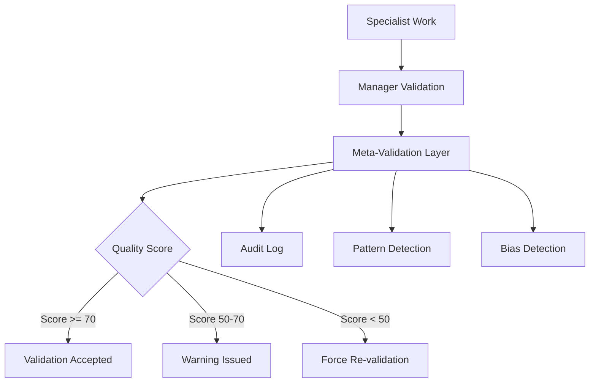

# BUMBA Meta-Validation System

## Overview

The **Meta-Validation System** validates the validation process itself, ensuring that manager validations are thorough, unbiased, and of high quality. This prevents rubber-stamping and maintains validation integrity.

## Problem Solved

Without meta-validation, managers could:
- 🏁 Approve everything (rubber-stamping)
- 🔴 Reject everything (over-strictness)
- 🟢 Rush through validations (too fast)
- 📝 Provide inadequate feedback
- 🟡 Miss critical checks

## How It Works



## Core Features

### 1. **Validation Quality Scoring** (0-100)
Each validation is scored based on:
- **Time Reasonableness** (15 points)
  - Too fast (<100ms) = rubber-stamping
  - Too slow (>30s) = performance issue
- **Check Completeness** (25 points)
  - Minimum 5 checks required
  - Must include: syntax, security, business_logic
- **Feedback Adequacy** (20 points)
  - Rejections must have detailed feedback
  - Minimum 20 characters of explanation
- **Pattern Normality** (10 points)
  - No suspicious consecutive patterns
- **Bias Freedom** (15 points)
  - No specialist favoritism
  - No time-based bias
- **Bonus Points** (15 points)
  - Extra thoroughness
  - Detailed feedback

### 2. **Pattern Detection**

Detects suspicious patterns:
- **Rubber-stamping**: >10 consecutive approvals
- **Over-strictness**: >5 consecutive rejections
- **Perfect scores**: All checks always pass
- **Consistent timing**: Validation times too uniform
- **Off-hours approvals**: Late night/early morning bias

### 3. **Bias Detection**

Identifies validation bias:
- **Specialist bias**: Always approving/rejecting specific specialists
- **Manager bias**: Approval rate >95% or <30%
- **Time bias**: Different standards at different times
- **Favoritism**: Patterns of preferential treatment

### 4. **Audit Trail**

Maintains comprehensive audit log:
- Timestamp of each validation
- Manager and specialist IDs
- Quality scores
- Issues detected
- Patterns identified

### 5. **Self-Adjustment**

System can self-adjust based on quality:
- **Quality < 60%**: Increase validation strictness
- **Quality > 90%**: Normalize validation standards
- **Persistent issues**: Alert administrators

## Integration Points

### Manager Validation Layer
```javascript
// Every validation is meta-validated
const metaResult = await this.metaValidation.validateValidation(
  validation,
  metaValidationContext
);

// Force re-validation if quality too low
if (metaResult.qualityScore < 50) {
  validation.requiresRevision = true;
  validation.approved = false;
}
```

### Quality Monitoring
```javascript
// Get validation health report
const report = validationLayer.getMetaValidationReport();
console.log(`Average Quality: ${report.averageQualityScore}/100`);
console.log(`Recommendation: ${report.recommendation}`);

// Check if validation is healthy
if (!validationLayer.isValidationHealthy()) {
  // Take corrective action
  validationLayer.adjustValidationStrictness();
}
```

## Thresholds and Standards

### Time Requirements
- **Minimum**: 100ms (prevent rubber-stamping)
- **Maximum**: 30,000ms (30 seconds)
- **Optimal**: 500-5000ms

### Check Requirements
- **Minimum checks**: 5
- **Required types**: syntax, security, business_logic
- **Recommended**: 8-10 checks for thorough validation

### Feedback Standards
- **Minimum length**: 20 characters
- **Required for rejections**: Yes
- **Should include**: Specific issues and recommendations

### Quality Thresholds
- **Excellent**: 90-100 (continue current practices)
- **Good**: 70-89 (minor improvements recommended)
- **Acceptable**: 50-69 (review flagged issues)
- **Poor**: <50 (immediate review required, force re-validation)

## Common Issues Detected

### 1. **Rubber-Stamping**
```
Issue: Validation completed too quickly (50ms)
Severity: HIGH
Recommendation: Ensure comprehensive review is performed
```

### 2. **Insufficient Checks**
```
Issue: Only 2 checks performed (minimum: 5)
Severity: HIGH
Recommendation: Perform more comprehensive validation
```

### 3. **Missing Feedback**
```
Issue: Rejection without adequate feedback
Severity: HIGH
Recommendation: Provide detailed, actionable feedback
```

### 4. **Suspicious Patterns**
```
Issue: 15 consecutive approvals - possible rubber-stamping
Severity: MEDIUM
Recommendation: Review validation criteria
```

### 5. **Potential Bias**
```
Issue: Manager approval rate >95%
Severity: MEDIUM
Recommendation: Ensure objective validation criteria
```

## Benefits

1. **Quality Assurance**: Ensures validations are thorough
2. **Bias Prevention**: Detects and prevents favoritism
3. **Pattern Recognition**: Identifies systemic issues
4. **Continuous Improvement**: Self-adjusting system
5. **Accountability**: Complete audit trail
6. **Trust**: Validates the validators

## Test Results

🏁 **All 6 meta-validation tests passed:**
1. Detects rubber-stamp validation
2. Detects insufficient checks
3. Detects missing feedback
4. Scores good validation properly
5. Detects suspicious patterns
6. Generates quality reports

## Configuration

```javascript
metaValidation.thresholds = {
  minValidationTime: 100,      // Minimum time (ms)
  maxValidationTime: 30000,    // Maximum time (ms)
  minChecksPerformed: 5,       // Minimum checks
  maxApprovalRate: 0.95,       // Suspicious if higher
  minApprovalRate: 0.3,        // Suspicious if lower
  minFeedbackLength: 20,       // Minimum feedback chars
  requiredCheckTypes: [        // Must include these
    'syntax',
    'security', 
    'business_logic'
  ]
}
```

## Usage Example

```javascript
// In any validated manager
class ValidatedManager {
  async validateWork(work) {
    // Perform validation
    const validation = await this.validate(work);
    
    // Meta-validate the validation
    const metaResult = await metaValidation.validateValidation(
      validation,
      { managerId: this.id, validationTime: elapsed }
    );
    
    // Check quality
    if (metaResult.qualityScore < 50) {
      console.error('Validation quality too low!');
      // Force re-validation with stricter checks
    }
    
    return validation;
  }
}
```

## Monitoring Dashboard

```
====================================
Validation Quality Report
====================================
Average Quality Score: 75.3/100
Total Validations: 1,247
Average Validation Time: 2,341ms

Current Patterns:
- Consecutive Approvals: 3
- Consecutive Rejections: 0

Common Issues (Last 100):
1. insufficient_checks: 12 times
2. missing_feedback: 8 times
3. too_fast: 5 times

Recommendation: 🏁 Validation system performing well
====================================
```

## Conclusion

The Meta-Validation System ensures that the validation process itself maintains high standards. By monitoring validation quality, detecting patterns, and identifying bias, it prevents both rubber-stamping and over-strictness, ensuring that all specialist work receives fair, thorough, and meaningful validation.

**Key Achievement**: The validation layer now validates itself, creating a self-improving quality assurance system that maintains integrity throughout the BUMBA framework.