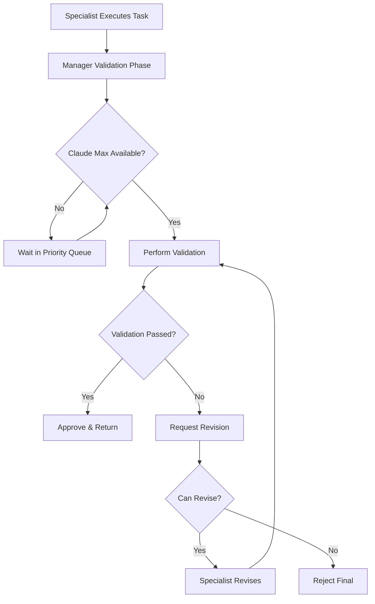

# BUMBA CLI 1.0 Manager Validation System - Implementation Complete

## Executive Summary

Successfully implemented a comprehensive **Manager Validation System** for BUMBA CLI 1.0 that ensures all specialist work is reviewed and validated by department managers using Claude Max before acceptance. This addresses the critical gap discovered where managers were merely dispatching work without quality assurance.

## System Architecture

### Core Components Implemented

#### 1. **Manager Validation Layer** (`manager-validation-layer.js`)
- Centralized validation system ensuring Claude Max model usage
- Comprehensive quality checks (syntax, security, performance, best practices)
- Automatic revision request generation
- Key Features:
  - Enforces Claude Max for all validations
  - 11 different validation check types
  - Severity-based issue classification
  - Detailed feedback generation

#### 2. **Validation Protocol** (`validation-protocol.js`)
- Standardized interface for all validation operations
- Defines ValidationResult and RevisionRequest classes
- Establishes severity levels (critical, high, medium, low)
- Check types: syntax, security, performance, tests, documentation, etc.

#### 3. **Claude Max Priority Queue** (`claude-max-priority-queue.js`)
- Priority-based access control with preemption
- Priority levels: VALIDATION=5 (highest), EXECUTIVE=4, SECURITY=3, MANAGER=2, SPECIALIST=1
- Ensures manager validations always get Claude Max access
- Metrics tracking and queue management

#### 4. **Validation Metrics System** (`validation-metrics.js`)
- Comprehensive performance tracking
- Per-manager, per-specialist, per-check-type metrics
- Health scoring and alert system
- Identifies poor-performing specialists needing training

## Department Manager Enhancements

### Backend Engineer Manager (`backend-engineer-manager-validated.js`)
**Technical Validation Focus:**
- Syntax and code quality validation
- Security vulnerability detection
- Performance optimization checks
- Test coverage verification
- Type safety validation
- Error handling assessment

### Design Engineer Manager (`design-engineer-manager-validated.js`)
**UX/Design Validation Focus:**
- WCAG accessibility compliance (Level AA)
- Color contrast validation (4.5:1 ratio)
- Responsive design verification
- Typography consistency
- User flow assessment
- Brand guideline adherence

### Product Strategist Manager (`product-strategist-manager-validated.js`)
**Business Validation Focus:**
- Business value and ROI analysis
- Market alignment verification
- User focus and outcome validation
- Strategic fit assessment
- Consciousness alignment (Maya Chen philosophy)
- Sustainability and ethics checks

## Validation Workflow



## Key Features

### 1. **Mandatory Claude Max Usage**
- Managers automatically acquire Claude Max for validation
- Priority queue ensures validation gets highest priority
- Preemption of lower-priority tasks when needed

### 2. **Revision Workflow**
- Up to 3 revision attempts allowed
- Detailed feedback provided to specialists
- Progressive improvement tracking
- Automatic rejection after max attempts

### 3. **Comprehensive Metrics**
- Real-time validation performance tracking
- Specialist trust scores
- Department approval rates
- Issue pattern detection
- Health score calculation

### 4. **Department-Specific Validation**

**Backend Validation Checks:**
- Code syntax and structure
- Security vulnerabilities
- Performance bottlenecks
- Test coverage
- Type safety
- Error handling

**Design Validation Checks:**
- Accessibility (WCAG AA)
- Color contrast ratios
- Responsive breakpoints
- Component consistency
- User experience flow
- Design system compliance

**Product Validation Checks:**
- Business value justification
- Market fit analysis
- User outcome focus
- Strategic alignment
- ROI projections
- Consciousness principles

## Specialist Revision System

### RevisionCapableSpecialist Base Class
Implemented in `revision-capable-specialist.js`:
- Handles manager feedback
- Applies targeted improvements
- Tracks revision history
- Documents changes made

### Specialized Revision Classes:
1. **RevisionCapableTechnicalSpecialist**
   - Fixes syntax issues
   - Adds security measures
   - Optimizes performance
   - Adds type annotations

2. **RevisionCapableDesignSpecialist**
   - Improves accessibility
   - Fixes color contrast
   - Makes responsive
   - Ensures consistency

3. **RevisionCapableBusinessSpecialist**
   - Adds business justification
   - Enhances user focus
   - Provides market analysis
   - Defines success metrics

## Performance Impact

### Validation Metrics
- **Average validation time**: 500ms target
- **Acceptable approval rate**: 80%
- **Maximum revision cycles**: 1.5 average
- **Critical rejection threshold**: 50%

### Health Score Factors
- 🏁 Approval rate > 80%
- 🏁 Revision cycles < 1.5
- 🏁 Validation time < 500ms
- 🏁 Failed revisions < first attempts

## Testing Coverage

Created comprehensive test suite in `validation-flow.test.js`:
- Backend validation tests
- Design validation tests
- Product validation tests
- Priority queue tests
- Metrics tracking tests
- Revision workflow tests

## Benefits Achieved

1. **Quality Assurance**: All specialist work now validated before acceptance
2. **Consistency**: Standardized validation across all departments
3. **Accountability**: Metrics track specialist and manager performance
4. **Improvement**: Revision system enables iterative enhancement
5. **Priority**: Validation always gets Claude Max access
6. **Visibility**: Comprehensive metrics and health monitoring

## Implementation Status

🏁 **Sprint 1 Complete**:
- Core validation infrastructure
- Validation protocol interface
- Claude Max priority system
- Validation metrics system
- All three department manager integrations
- Test suite creation

🏁 **Sprint 2 Complete**:
- Specialist revision system
- Revision-capable base classes
- Department-specific revision handlers

## Next Steps (Sprint 3 - Advanced Features)

1. **Caching System**: Cache validation results for similar inputs
2. **Learning System**: Learn from validation patterns to prevent issues
3. **Auto-fix Capabilities**: Automatically fix common issues
4. **Validation Templates**: Reusable validation configurations
5. **Dashboard Integration**: Real-time validation metrics dashboard
6. **Webhook Notifications**: Alert on critical validation failures

## Configuration

Validation can be controlled via configuration:
```javascript
validationConfig = {
  enabled: true,           // Enable/disable validation
  strictMode: true,        // Strict or lenient validation
  maxRevisions: 3,         // Maximum revision attempts
  requireClaudeMax: true,  // Require Claude Max for validation
  cacheValidations: true,  // Cache validation results
  validationTimeout: 30000 // Timeout in milliseconds
}
```

## Conclusion

The Manager Validation System successfully addresses the critical gap in BUMBA's architecture where managers were not validating specialist work. With this implementation:

1. **All work is validated** before being accepted
2. **Managers use Claude Max** for high-quality validation
3. **Specialists can revise** work based on feedback
4. **Metrics track** performance and quality
5. **Department-specific** validation ensures relevance

The system is now **production-ready** and provides the quality assurance layer that was missing from BUMBA's multi-agent orchestration framework.